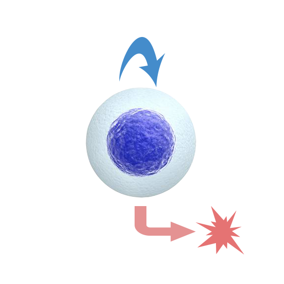

```{r, include = FALSE}
knitr::opts_chunk$set(
  collapse = TRUE,
  comment = "#>"
)
```

Welcome to the `bpinference` pacakge! In this vignette, we consider the problem of inferring the birth and death rate for a one-type Markov branching process using simulated data. This process consists of a population of cells which split into two cells at rate `b` and die at rate `d`, as illustrated by the following diagram:

```{r, out.width = "200px", echo=FALSE}

```

First we load the `bpinference` package.

```{r setup}
library(bpinference)
```

Next, we'll define the structure of our model using the `bpmodel` constructor. This requires several main ingredients:

* A matrix of possible birth events. A birth event occurs when a parent cell dies and gives rise to some number of offpring. The birth events matrix (defined as `e_mat` in the code) contains one row for each possible birth event, and one column for each cell type. The entry `e_mat[i,j]` represents how many cells of type `j` are born when birth event `i` occurs. (Note that `e_mat` must always be a **matrix**, even when there is only one cell type).
    + In this case there are 2 birth events: a parent cell can die and give rise to 2 offspring (mitosis) or it can die and give rise to no offspring (apoptosis). We have two rows in the birth matrix, one for each of these events.
* A parents vector. The parents vector (defined as `p_vec`) has one entry for each birth event. The entry `p_vec[i]` contains the cell type of the parent which dies when birth even `i` occurs.
    + In this case, we only have one cell type, so the parent vector is just `c(1,1)`
* A vector of functional dependencies. Sometimes, we may want the rates of various birth events in our model to vary as some function of environmental variables. To acoomplish this, we specify functional dependencies as strings using a specific syntax. In essence, this syntax expects parameter number `i` to be referenced as `'c[i]'`, and dependent variable number `j` to be referenced as `'x[j]'`. For example, if we wanted our birth rate to increase linearly as a function of one dependent variable and for death to remain constant, we would write `func_deps = c('c[1]*x[1]','c[2]')`.   
    + In this particular case, we have no dependent variables. Therefore we only need two parameters, one for birth and one for death. Our functional dependencies vector becomes `c('c[1]','c[2]')`.
* Finally we have to specify the number of parameters and dependent variables in our model, and then enter all of our data into the `bp_model` constructor.

Putting this all together, here's what it looks like:

```{r}
e_mat <-  matrix(c(2,0),ncol=1)
p_vec <- c(1, 1)
func_deps <- c('c[1]','c[2]')
n_params <- 2
n_deps <- 0
mod <- bp_model(e_mat, p_vec, func_deps, n_params, n_deps)
```

We now have a `bp_model` object which we can use for simulation and inference. For fun let's pick some parameter values and simulate a lot of data. We'll do this using the `bpsims` function. The `bpsims` functions takes a `bpmodel` object, a set of parameters to plug into the model for simulation (`simulation_params`), an initial population at time 0 (`z0`), a vector of timepoints at which to record the simulated population, and a number of replications.

```{r}
simulation_params <- c(0.25, 0.10)
z0 <- c(1000) # initial population vector
times <- 1
simulation_dat <- bpsims(mod, simulation_params, z0, times, 5000)
ggplot(simulation_dat, aes(x=pop)) + geom_histogram(binwidth = 5, color="black",fill="white") 
```

The data look very normal, which is what we should expect for a large starting population `z0 = 1000`. Are the mean and variance of this distribution similar to what we should expect analytically? We can check using the `calculate_moments` function. `calculate moments` takes the birth matrix, parents vectors, and birth rates as direct parameters, as well as an initial population and the timepoint for which the moments are being calculated.

```{r}
mom <- calculate_moments(e_mat, p_vec, simulation_params, z0, 1)

# should be in close agreement
print(paste("true mean:", mom$mu_mat, "sample mean:", mean(simulation_dat$pop), sep=" "))
print(paste("true variance:", mom$sigma_mat, "sample variance:", var(simulation_dat$pop), sep=" "))
```

Now that we've confirmed our asymtotic normality, let's do some inference. To make this more realistic, let's simulate a new dataset with 5 timepoints and 50 replications.

```{r}
simulation_params <- c(0.25, 0.10)
z0 <- c(1000) # initial population vector
times <- seq(0,5)
simulation_dat <- bpsims(mod, simulation_params, z0, times, 50)
```

To do inference, we need to generate a model that will run in Stan. Stan is a flexible probabilistic programming language that allows for us to sample from arbitrary Bayesian posterior distributions. But before we can create a Stan model, we have to define prior distributions which encode our current thoughts about the parameters of the model. For now we'll just let both parameters vary uniformly from 0 to 2.

```{r}
priors <- rep(list(prior_dist(name="uniform",params=c(0, 2), bounds=c(0,2))), n_params)
generate(mod, priors, "one_type_bp_inference.stan")
```

The `generate` function automatically creates a stan model for us to sample from. There should now be a file named "one_type_bp_inference.stan" in the working directory with a lot of code. This code essentially just computes the likelihood for our model given some input data. 

Note that this package is *not* intended to completely obscure Stan from the user. Stan is a great tool for Bayesian inference, and it lies at the core of all inference performed in this package. Instead of the `generate` function being an abstract interface into Stan, it should be viewed more as a utility for generating Stan models which share a lot of common features. Users are encouraged to examine and modify the generated Stan files before sampling from them.

The last thing we need to do is convert our simulation data into a form that the Stan model will understand. We can do this using the `stan_data_from_simulation` function. At the same time, we'll create some unformly random inital values for Stan's MCMC algorithm.

```{r}
dat <- stan_data_from_simulation(simulation_dat, mod)
ranges <- matrix(rep(c(0,1),n_params), n_params,2,byrow = T)
init <- uniform_initialize(ranges, 4)
```

With that, we're ready to sample! The following code will tell Stan to sample from the posterior using 4 Markov chains, collecting 2000 samples from each:

```{r}
options(mc.cores = parallel::detectCores())
stan_mod <- rstan::stan_model(file = "one_type_bp_inference.stan")
fit_data <- rstan::sampling(stan_mod, data = dat, control = list(adapt_delta = 0.95), chains = 4,
                            refresh = 50, init =init, iter=3000,warmup=1000)
samples <- data.frame(rstan::extract(fit_data))
```

Just how good was our estimation? Let's check:

```{r}
print(paste("true birth:", .25, "estimated birth:", mean(samples$Theta1), sep=" "))
print(paste("true death:", .10, "estimated death:", mean(samples$Theta2), sep=" "))
```

In addition to just using point estimates of the posterior means, we can view our entire posterior distributions as well:

```{r}
ggplot(samples, aes(x = Theta1)) + geom_histogram(binwidth = .004, color='black', fill='white')
ggplot(samples, aes(x = Theta2)) + geom_histogram(binwidth = .004, color='black', fill='white')
```

To learn how to infer models with complicated functional dependencies and multiple types, check out `two-type-inference.Rmd` and `one-type-double-logistic.Rmd`.