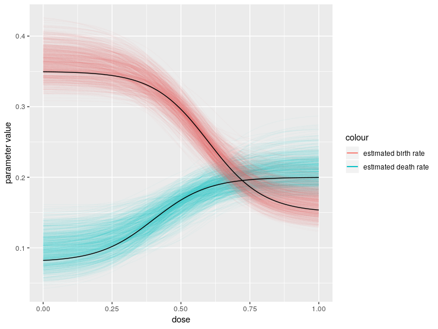

```{r, include = FALSE}
knitr::opts_chunk$set(
  collapse = TRUE,
  comment = "#>"
)
```

In this vignette, we consider the problem of estimating the parameters of a stochastic model in which cell growth rates vary as a function of some environmental variable. One good example is a cancer cell line growing *in vitro* and responding to changes in the dose of some drug.

First we load the `bpinference` package.

```{r setup}
library(ggplot2)
devtools::load_all()
library(rstan)
```

Next, we'll define the structure of our model. As in the `first-model.Rmd` vignette, this will require three main components.

* A matrix of possible birth events. This is the same as in `first-model.Rmd`.
* A parents vector. Also the same as in `first-model.Rmd`.
* A vector of functional dependencies. This is where this example gets interesting. We're going to assume that, as drug concentration inreases, birth rates go down and death rates go up, both according to a 4-parameter logistic model. In math, this looks like:

$b = c_1 + \frac{c_2}{ 1 +\exp{(-c_3(x_1 - c_4))}}\\ d = c_5 - \frac{c_6}{1+\exp{(-c_7(x_1 - c_8))}}$

We can encode this functional dependence into our model with the following code:

```{r}
e_mat <-  matrix(c(2,0),ncol=1)
p_vec <- c(1, 1)
func_deps = c('c[1] + c[2]/(1 + exp(c[3]*(x[1] - c[4])))','c[5] - c[6]/(1 + exp(c[7]*(x[1] - c[8])))') #double logistic functions
n_params <- 8
n_deps <- 1
mod = bp_model(e_mat, p_vec, func_deps, n_params, n_deps)
```

We now have a `bp_model` object which we can use for simulation and inference. Next, we simulate an experiment in which we expose the population to 6 different drug concentrations. There are 20 different cultures exposed to each drug concentration, and each culture has its population recorded 5 times at regular intervals. The `c_mat` parameter to our simulation functionidentifies the different dependent variable levels at which we wish to simulatie. 

```{r}
times = seq(0,5)
z0 = c(1000) # initial population vector
simulation_params = c(0.15, .2, 10, 0.6, 0.2, .12, 10, .4)
c_mat= matrix(c(0.0,0.2,0.4,0.6,0.8,1.0), ncol=1)
simulation_data = bpsims(mod, simulation_params, z0, times, rep(20,6), c_mat)
```

Next we define our priors, generate the Stan model, and prepare our sampling data.

```{r}
priors = rep(list(list(name="normal",params=c(0, .5), bounds=c(0,2))),8)
priors[[3]] = list(name="uniform",params=c(5,15), bounds=c(5,15))
priors[[7]] = list(name="uniform",params=c(5,15), bounds=c(5,15))
generate(mod, priors, "one_type_double_logistic.stan")

dat = stan_data_from_simulation(simulation_data, mod)
ranges = matrix(rep(c(0,1), length(simulation_params)),ncol=2,byrow = T)
ranges[3,] = c(5,15)
ranges[7,] = c(5,15)
init = uniform_initialize(ranges, 4)
```

Now all that's left is to do is sample. This model is a bit more complex than the simple birth-death model, so it will take significantly longer to finish sampling. Here's the code to run the sampler:

```{r eval=FALSE}
options(mc.cores = parallel::detectCores())
stan_mod <- stan_model(file = "one_type_double_logistic.stan")
fit_data = sampling(stan_mod, data = dat, control = list(adapt_delta = 0.95), chains = 4, refresh = 1, init =init)
samples = data.frame(extract(fit_data))
```

To visualize how well we did, we'll plot a cloud of response curves that we sampled from the posterior and compare them with ground truth. 
```{r eval=FALSE}
compute_birth_curve = 
  function(params, doses){sapply(doses, function(x){params[1] + params[2]/(1 + exp(params[3]*(x - params[4])))})}
compute_death_curve = 
  function(params, doses){sapply(doses, function(x){params[1] - params[2]/(1 + exp(params[3]*(x - params[4])))})}
sample_birth_curves = apply(samples[1:800,1:4], 1, compute_birth_curve, seq(0,1,length.out = 1000)) 
sample_death_curves = apply(samples[1:800,5:8], 1, compute_death_curve, seq(0,1,length.out = 1000)) 
bcurves = cbind(melt(data.frame(sample_birth_curves)),dose = seq(0,1,length.out = 1000))
dcurves = cbind(melt(data.frame(sample_death_curves)),dose = seq(0,1,length.out = 1000))

ggplot(dcurves, aes(x=dose, y=value, group = factor(variable))) + geom_line(aes(color="estimated death rate"),alpha=.03) + geom_line(data = bcurves,aes(color = "estimated birth rate"), alpha = .03) + ylab("parameter value") + geom_line(data = data.frame(cbind(dose = seq(0,1,length.out = 1000), value = compute_birth_curve(simulation_params[1:4],seq(0,1,length.out = 1000)),variable=1))) + geom_line(data = data.frame(cbind(dose = seq(0,1,length.out = 1000), value = compute_death_curve(simulation_params[5:8],seq(0,1,length.out = 1000)),variable=1))) + guides(colour = guide_legend(override.aes = list(alpha = 1)))
```



That looks pretty good! Notice how we've been able to tease apart changes in birth and death rates just from looking at total cell counts. Current widely-used methods in pharmacology can only measure changes in net growth rate, so using a Bayesian growth assay like this one could help give us a finer-grained understanding of how drugs act on various cell lines.

